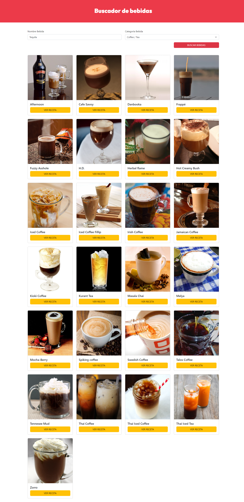

# Search Drinks

This project is about a beverage search engine with an API, it is developed with react and vite
 
# Screen Project  
## Computer
<div align="center">

</div>

## Phone
<div align="center">

</div>
# Install

```sh
git clone https://github.com/asalinasf/search-drinks/
cd search-drinks
npm install
npm run dev
```

# Visit my project with this url

https://search-drinks-vite.netlify.app/
